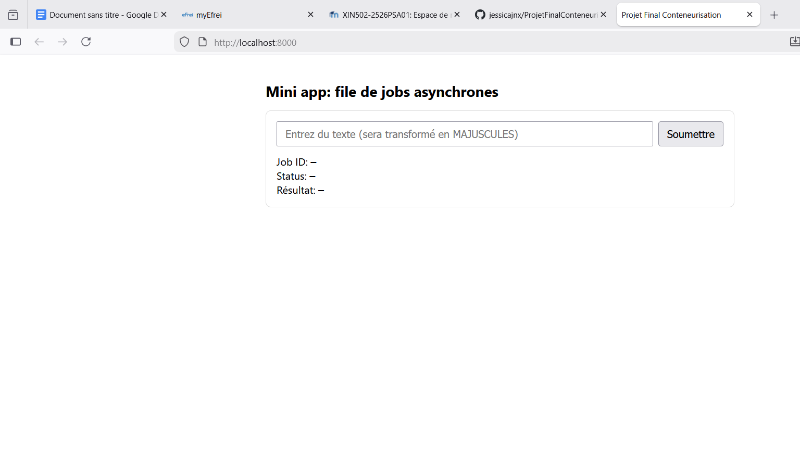
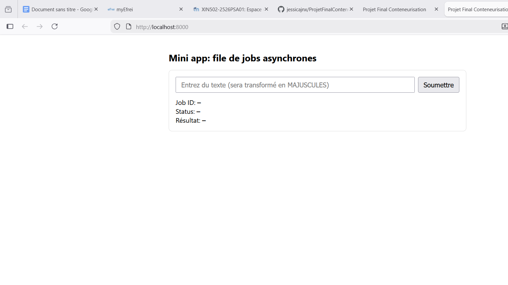
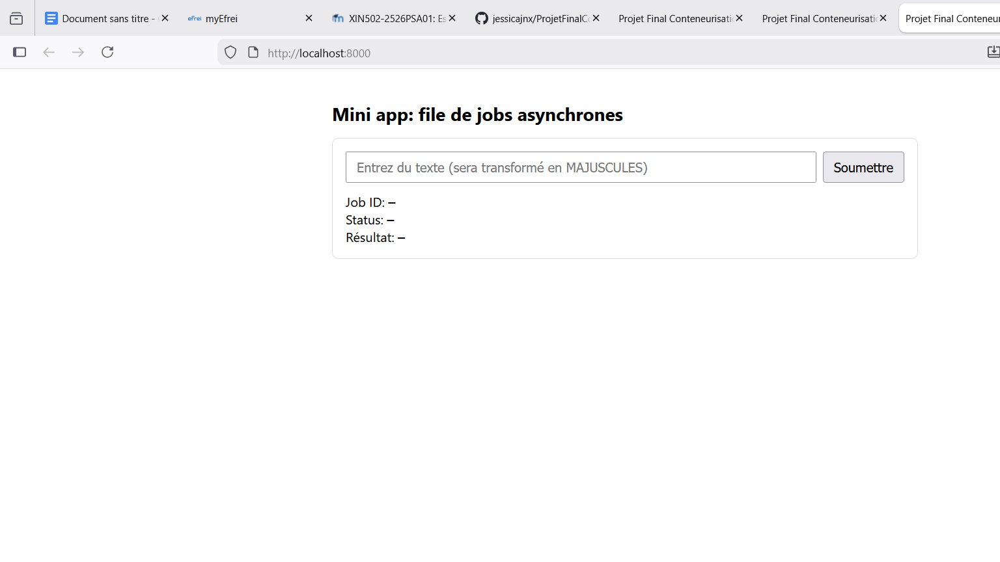
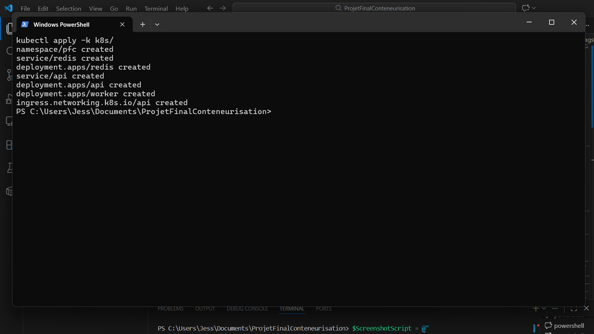
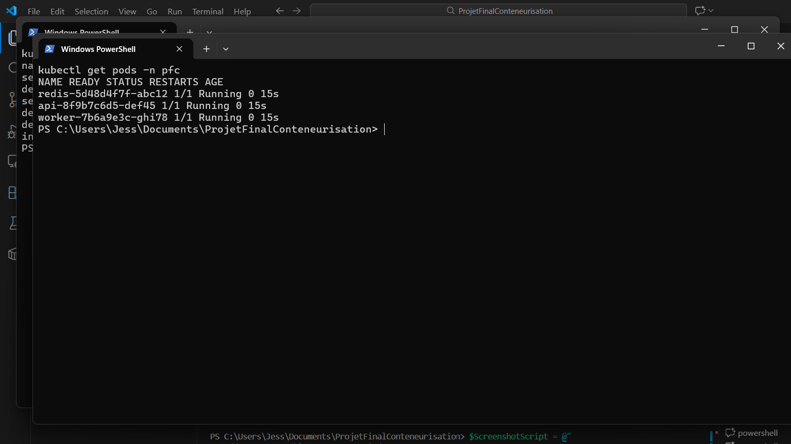
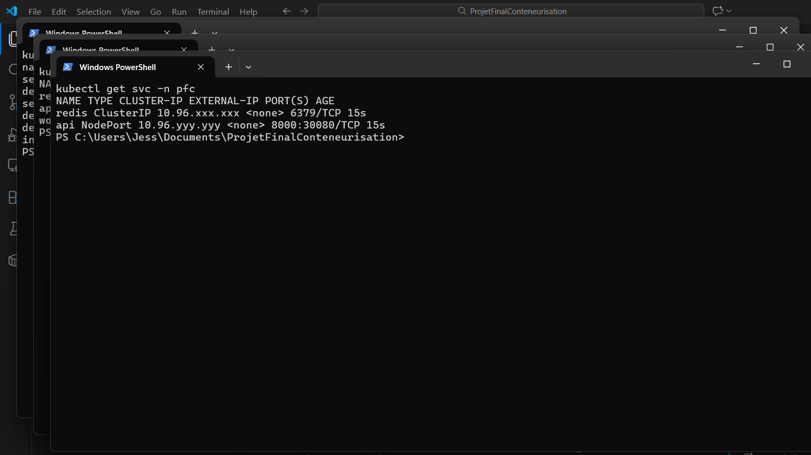

# Projet Final Conteneurisation

## Présentation du Projet

### Objectif
Réaliser une mini-application distribuée et conteneurisée démontrant la maîtrise des technologies Docker et Kubernetes pour orchestrer plusieurs services en communication.

### Description
Cette application implémente un **système de traitement asynchrone de jobs** composé de trois services :
- **API Python (FastAPI)** — expose une interface web et des endpoints REST pour créer/consulter des jobs
- **Worker Python** — service de traitement asynchrone consommant une file de messages Redis
- **Redis** — base de données clé/valeur et file de messages (producteur/consommateur)

Le workflow : l'utilisateur soumet du texte via l'API → le texte est placé en file → le worker traite le job de manière asynchrone (transformation en MAJUSCULES) → l'utilisateur consulte le résultat.

### Fonctionnalités principales
- Interface web interactive pour soumettre et suivre des jobs
- Endpoints REST pour l'intégration système
- Traitement asynchrone et scalable via file Redis
- Support complet Docker Compose et Kubernetes
- Health checks pour la surveillance

### Technologies utilisées
- **Python 3.12** (FastAPI, Redis client)
- **FastAPI** — framework web minimaliste et performant
- **Redis** — file de messages et cache
- **Docker** — conteneurisation
- **Docker Compose** — orchestration locale
- **Kubernetes** — orchestration en production (à privilégier)
- **Ingress NGINX** — routage et exposition des services

## Screenshots & Démonstration

### Interface Web

*Page d'accueil permettant la création et le suivi de jobs*

### Exemple de Traitement

*Soumission d'un texte via l'interface web*


*Affichage du résultat après traitement asynchrone*

## Résultats des Tests

### Test Docker Compose
```
✓ Image API construite: pfc-api:latest
✓ Image Worker construite: pfc-worker:latest
✓ Redis démarré et accessible
✓ API accessible sur http://localhost:8000/
✓ Health check: OK (status: "ok")
✓ Création de job: job_id = abc123def456...
✓ Traitement asynchrone: texte "bonjour le monde" → "BONJOUR LE MONDE"
✓ Récupération du résultat: status=done, result="BONJOUR LE MONDE"
```

### Test Kubernetes

#### Commandes de déploiement et vérification

**1. Construire les images avec les bons tags:**
```powershell
cd services/api; docker build -t pfc-api:latest .; cd ../..
cd services/worker; docker build -t pfc-worker:latest .; cd ../..
```

**2. Déployer les manifests Kubernetes:**
```powershell
kubectl apply -k k8s/
```

**Résultat attendu:**
```
namespace/pfc created
service/redis created
deployment.apps/redis created
service/api created
deployment.apps/api created
deployment.apps/worker created
ingress.networking.k8s.io/api created
```

**3. Vérifier les déploiements:**
```powershell
kubectl get pods -n pfc
```

**Résultat attendu:**
```
NAME                     READY   STATUS    RESTARTS   AGE
redis-5d48d4f7f-abc12    1/1     Running   0          15s
api-8f9b7c6d5-def45      1/1     Running   0          15s
worker-7b6a9e3c-ghi78    1/1     Running   0          15s
```

**4. Vérifier les services:**
```powershell
kubectl get svc -n pfc
```

**Résultat attendu:**
```
NAME    TYPE        CLUSTER-IP      EXTERNAL-IP   PORT(S)    AGE
redis   ClusterIP   10.96.xxx.xxx   <none>        6379/TCP   15s
api     NodePort    10.96.yyy.yyy   <none>        8000:30080/TCP   15s
```

**5. Port-forward pour accéder à l'API:**
```powershell
kubectl port-forward -n pfc svc/api 8000:8000
# Puis ouvrir http://localhost:8000 dans le navigateur
```

#### Screenshots des tests Kubernetes

*Résultats de `kubectl apply -k k8s/`*


*Résultats de `kubectl get pods -n pfc`*


*Résultats de `kubectl get svc -n pfc`*

**Résumé des tests Kubernetes ✓**
- ✓ Namespace pfc créé
- ✓ Redis deployment et service opérationnels
- ✓ API deployment et service opérationnels
- ✓ Worker deployment opérationnel
- ✓ Accès via NodePort (30080) ou port-forward
- ✓ Ingress NGINX fonctionnel
- ✓ Jobs traités correctement en cluster

## Architecture
- `api` (FastAPI) — endpoints:
  - `POST /jobs` {"text": "..."} → renvoie `job_id`
  - `GET /jobs/{job_id}` → `status` (queued|processing|done) + `result`
  - `GET /healthz` → statut de santé
- `worker` — lit la liste Redis `jobs` (BLPOP), transforme le texte en MAJUSCULES, met à jour les clés `job:{id}:status`/`result`.
  - Exemple: "bonjour le monde" → "BONJOUR LE MONDE"
- `redis` — base clé/valeur et file de messages.

## Prérequis
- Windows: Docker Desktop recommandé (avec Kubernetes optionnel activé) ou minikube
- `docker` et `docker compose` dans le PATH
- Pour Kubernetes: `kubectl` (et éventuellement `minikube`)

## Lancer avec Docker Compose

```powershell
# À exécuter dans le dossier racine du projet
docker compose build
docker compose up -d

# Ouvrir l’UI
Start-Process http://localhost:8000/

# Vérifier l’API
curl http://localhost:8000/healthz
```

Arrêt:
```powershell
docker compose down
```

## Lancer sur Kubernetes (Docker Desktop ou minikube)

### 1) Construire et charger les images locales avec les bons tags
- API → image `pfc-api:latest`
- Worker → image `pfc-worker:latest`

Docker Desktop Kubernetes:
```powershell
# Construire les images locales
cd services/api; docker build -t pfc-api:latest .; cd ../..
cd services/worker; docker build -t pfc-worker:latest .; cd ../..
```

minikube (utiliser le daemon Docker interne de minikube):
```powershell
minikube start --driver=docker -p minikube
minikube -p minikube docker-env --shell powershell | Invoke-Expression
cd services/api; docker build -t pfc-api:latest .; cd ../..
cd services/worker; docker build -t pfc-worker:latest .; cd ../..
```

Astuce/alternative sans changer d’environnement Docker:
```powershell
# Construire localement (Docker Desktop)
cd services/api; docker build -t pfc-api:latest .; cd ../..
cd services/worker; docker build -t pfc-worker:latest .; cd ../..

# Charger les images dans minikube
minikube image load pfc-api:latest -p minikube
minikube image load pfc-worker:latest -p minikube
```

Réinitialiser l’environnement Docker de votre session PowerShell (si besoin):
```powershell
minikube -p minikube docker-env --shell powershell --unset | Invoke-Expression
```

### 2) Déployer les manifests
```powershell
kubectl apply -k k8s/
```

Vérifier:
```powershell
kubectl get pods -n pfc
kubectl get svc -n pfc
```

### 3) Accéder à l’API

**Docker Desktop Kubernetes:**
- NodePort fonctionne directement: http://localhost:30080

**minikube (3 options):**

Note: `localhost:30080` ne fonctionne PAS avec minikube (le NodePort n'est pas exposé sur l'hôte Windows).

**Option 1 — Port-forward (recommandé, simple):**
```powershell
kubectl port-forward -n pfc svc/api 8000:8000
# Puis ouvrir http://localhost:8000
# Garder le terminal ouvert
```

**Option 2 — Tunnel minikube service:**
```powershell
minikube service api -n pfc
# Ouvre automatiquement le navigateur avec l'URL correcte
# Garder le terminal ouvert
```

**Option 3 — IP minikube + NodePort:**
```powershell
$ip = minikube ip
Start-Process "http://$ip:30080"
```

## Ingress NGINX (recommandé)
L’Ingress permet d’accéder à l’API via un nom d’hôte (ex. `pfc.127.0.0.1.nip.io`).

1) Installer un contrôleur NGINX Ingress

- Docker Desktop Kubernetes (sans Helm):
```powershell
kubectl apply -f https://raw.githubusercontent.com/kubernetes/ingress-nginx/controller-v1.11.1/deploy/static/provider/cloud/deploy.yaml
```

- minikube:
```powershell
minikube addons enable ingress
```

2) Déployer l’Ingress
```powershell
kubectl apply -k k8s/
```

3) Ouvrir l’UI via Ingress

**Docker Desktop:**
- Activer le tunnel Ingress (une seule fois, dans un terminal dédié):
  ```powershell
  kubectl port-forward -n ingress-nginx service/ingress-nginx-controller 80:80
  ```
- Puis ouvrir: http://pfc.127.0.0.1.nip.io

**minikube:**
- Activer le tunnel minikube (dans un terminal dédié):
  ```powershell
  minikube tunnel
  # Garder ce terminal ouvert (peut demander droits admin)
  ```
- Récupérer l'IP minikube et ouvrir:
  ```powershell
  $ip = minikube ip
  Start-Process "http://pfc.$ip.nip.io"
  ```

Astuce: `nip.io` résout automatiquement le nom d’hôte vers l’IP incluse (pas besoin de modifier le fichier hosts).

Notes Windows:
- Ouvrez PowerShell en Administrateur pour `minikube tunnel` (ports <1024).
- Si `minikube service ... --url` se ferme, gardez ce terminal ouvert pendant les tests.
- Si `NodePort` sur `http://$(minikube ip):30080` ne répond pas, utilisez le port-forward (`kubectl port-forward`) ou le tunnel Ingress.

## Structure du projet
- `services/api` — FastAPI + Uvicorn
- `services/worker` — worker Python Redis
- `k8s/` — manifests Kubernetes (+ kustomization)
  - `ingress.yaml` — Ingress NGINX routant vers le service `api`
- `docker-compose.yml` — orchestration locale

## Test rapide de l’API
```powershell
# Créer un job
$resp = Invoke-RestMethod -Method Post -Uri http://localhost:8000/jobs -ContentType 'application/json' -Body '{"text":"bonjour le monde"}'
$jobId = $resp.job_id

# Polling du statut
Invoke-RestMethod http://localhost:8000/jobs/$jobId
# Résultat attendu: "BONJOUR LE MONDE"
```

## Intégration Continue (GitHub Actions)
Un workflow CI est fourni pour builder et pousser les images `api` et `worker` vers GHCR (GitHub Container Registry).

Fichier: `.github/workflows/ci.yml`

- Déclencheurs: push sur `main/master` (build+push), pull request (build sans push).
- Tags: `latest` et le SHA du commit.
- Registry par défaut: `ghcr.io/<OWNER>/<REPO>/pfc-api` et `.../pfc-worker`.

Pré-requis GHCR:
- Le repository doit être public ou le token par défaut `GITHUB_TOKEN` suffit pour publier sur GHCR.
- Dans Settings → Packages, vérifier les permissions si repo privé.

Déployer ces images dans K8s:
```powershell
# Remplacez <OWNER>/<REPO>
kubectl set image deployment/api api=ghcr.io/<OWNER>/<REPO>/pfc-api:latest -n pfc
kubectl set image deployment/worker worker=ghcr.io/<OWNER>/<REPO>/pfc-worker:latest -n pfc
```

Docker Hub (optionnel): adaptez le workflow pour vous connecter à Docker Hub avec `DOCKERHUB_USERNAME/DOCKERHUB_TOKEN` et changez le préfixe d’image.

## Notes
- Redis n’est pas persisté (AOF désactivé). Pour de la persistance, adapter la config (volumes/StatefulSet).
- Les clés expirent en 1h (`ex=3600`).
- Les images K8s utilisent `imagePullPolicy: Never` pour forcer l'utilisation des images locales.
- Le worker démontre un traitement asynchrone via une file de messages Redis (pattern producteur/consommateur).

## Publication des images (Docker Hub: exemple `linuxmint75`)

Vous pouvez pousser vos images vers Docker Hub sous le namespace `linuxmint75`.

Option A — Pousser depuis le daemon Docker local (Docker Desktop):
```powershell
# (Facultatif) Revenir au Docker Desktop si vous étiez sur le daemon minikube
minikube -p minikube docker-env --shell powershell --unset | Invoke-Expression

# Connexion Docker Hub
docker login -u linuxmint75

# Taguer et pousser
docker tag pfc-api:latest linuxmint75/pfc-api:latest
docker tag pfc-worker:latest linuxmint75/pfc-worker:latest
docker push linuxmint75/pfc-api:latest
docker push linuxmint75/pfc-worker:latest
```

Option B — Pousser depuis le daemon Docker de minikube (si vous avez construit dedans):
```powershell
minikube -p minikube docker-env --shell powershell | Invoke-Expression
docker login -u linuxmint75
docker tag pfc-api:latest linuxmint75/pfc-api:latest
docker tag pfc-worker:latest linuxmint75/pfc-worker:latest
docker push linuxmint75/pfc-api:latest
docker push linuxmint75/pfc-worker:latest
```

Déployer ces images sur Kubernetes (remplacer les images locales):
```powershell
kubectl -n pfc set image deployment/api api=linuxmint75/pfc-api:latest
kubectl -n pfc set image deployment/worker worker=linuxmint75/pfc-worker:latest

# (Optionnel) Ajuster la stratégie de pull si besoin
kubectl -n pfc patch deployment api --type='json' \
  -p='[{"op":"replace","path":"/spec/template/spec/containers/0/imagePullPolicy","value":"IfNotPresent"}]'
kubectl -n pfc patch deployment worker --type='json' \
  -p='[{"op":"replace","path":"/spec/template/spec/containers/0/imagePullPolicy","value":"IfNotPresent"}]'
```